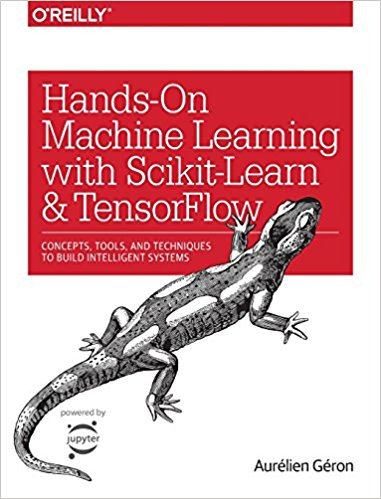

# Introduction to TensorFlow

---

We will walk through the basics of TensorFlow from start to finish, including implementation details for a Linear Regression model and a LSTM RNN neural network.

Several other technologies that assist in machine learning tasks and data visualization will be briefly introduced.

---
---

## Overview

#### [Setting Up Python Environment](#python-environment)
#### [Installing Dependencies](#installing-dependencies)
#### [TensorFlow Basics](#tensorflow-basics)
#### [Warming Up With Linear Regression](#linear-regression)
#### [Sentiment Analysis With Recurrent Neural Network](#sentiment-analysis)
#### [What's Next](#what-next)

----
---

## Python Environment

I'm working on macOS. Different operating systems may have slightly different requirements, but there are tons of online resources to help you with setup.

I am also assuming Python and it's package manager pip is installed. If not, be sure to start there!

You can easily confirm installation from your terminal. Here are my current versions:

```
# confirm Python version
$ python -V     
Python 2.7.10

# confirm pip version
$ pip -V
pip 9.0.1 from /Library/Python/2.7/site-packages/pip-9.0.1-py2.7.egg (python 2.7)
```

---


### VirtualEnv

We will be using Virtualenv to create an isolated environment and manage packages, check out the [Virtualenv documentation] for more details. There are other options available and they are discussed on the [Tensorflow installation page]. Another popular package and environment manager that I have had success with is [Anaconda].

An isolated environment will help to avoid package and versioning conflicts. Any packages installed within a Virtualenv will not affect the global Python installation, or any other environments.

Installing VirtualEnv

```
# Installation
$ pip install --user --upgrade virtualenv

# Confirm Installation
$ virtualenv --version
15.1.0
```

Activating New Virtual Environment

```
# Create new working project directory
$ mkdir NewProject && cd NewProject

# Create virtualenv
$ virtualenv env

# Activate virtualenv
$ source env/bin/activate

# When virtualenv is active, the environment name will prefix terminal command line
(env) $

# When finished, deactivate the virtualenv
(env) $ deactivate
```

---
---

## Installing Dependencies

We will now install all dependencies used in this tutorial.

If not yet active, start by activating your virtualenv.

```
$ source env/bin/activate
(env) $ pip install --upgrade jupyter matplotlib numpy pandas scipy scikit-learn tensorflow
```

---
 ### Package Descriptions

[Jupyter Notebook]
- creates web based IDE by starting up local server
  - easily deploy to remote machine with more powerful resources
- create checkpoints and check into version control
- easily share active projects with friends / colleagues
- work with snippits (cells) of code
  - easily re-run snippets instead of re-running entire program
- embded Markdown, HTML, JavaScript, and more into notebooks
- export as HTML and embed into web pages

[Matplotlib]
- easy to use 2D charting library

[NumPy]
- efficient representation of and operations on large multidimensional arrays

[Pandas]
- data analysis library
- extracts data from file/numpy/database and loads it into 'DataFrame' object
- provides variety of DataFrame methods for analyzing and visualizing data

[SciPy]
- scientific computing library
- optimization, linear algebra, integration, interpolation, FFT, signal and image processing and more

[Scikit-Learn]
- easy to use library with many popular machine learning algorithms
- utilities for manipulating data sets and preparing data for machine learning
- several data sets available for learning at sklearn.datasets module

---

### Starting up Jupyter Notebook:
```
$ jupyter notebook
```

This will start a local Jupyter server that can be viewed at loalhost:8888.

Open it up and try executing some code to get familiar.

If you have multiple versions of Python on your machine, you can select which version to use as your kernel when you create a new notebook.

---

---

## TensorFlow Basics

The open source library was designed for data flow programming and is fine-tuned for large scale machine learning tasks. It was made open source by Google in November of 2015, check out the [TensorFlow Release Article] published by Google. The library is heavily used by Google in both research and in production, which says a lot!

---

### Some Advantages of TensorFlow
- runs on any platform - Windows, Linux, macOS, Android, or iOS
- easy to use Python API that is compatible with Scikit-Learn
- very flexible, capable of creating any imaginable neural network architecture
- out of the box GPU and distributed computing support, allowing developers to train models on collassal data sets with millions of features and instances
- automatic differentiating - a variety of advanced optimization nodes available that search for parameters to minimize cost functions
- Goodle cloud service for executing TensorFlow programs remotely
- very popular, large community, a lot of resources, and great documentation
- TensorBoard visualization tool for viewing computation graphs and learning curves
- TPU - Google's very own ASIC designed for deep learning
  - [Cloud TPU] available on Google Cloud 
  - Google claims [15 - 30 X faster and 30 - 80 X more energy efficient than GPU/CPU environments]

---

### Disadvantages of TensorFlow
- the increased flexibility and power of TensorFlow creates a steeper learning curve than alternative machine learning libraries
  - Several high level APIs have been created to simplify the workflow and make deep learning available to more users: [Keras] and [Estimators] are just two examples of high level APIs available

---

### General Workflow
1. Define a TensorFlow graph that outlines data variables, placeholders, and operations
2. Create TensorFlow session to execute the graph
3. TensorFlow executes the graph's dataflow using optimized C++ code while maximizing available computation resources

---
---

## Linear Regression

This is a toy problem that will introduce basic TensorFlow concepts:

1. Load data from Scikit-Learn
2. Examine data with Pandas and Matplotlib
3. Define a TensorFlow graph that implements Linear Regression
4. Execute graph with TensorFlow session
5. Visualize TensorFlow graph and training summaries with Tensorboard
6. Evaluate model with test set

- check out the completed [Linear Regression Notebook] - comments, plots, and TensorBoard images are included!

---
---

## Sentiment Analysis with LSTM Recurrent Neural Network

We will take a closer look at creating neural networks with TensorFlow. We will create a LSTM (long short-term memory) RNN to perform Sentiment Analysis on a IMDb movie review data set containing 25K movie reviews.

Here are a couple articles introducing recurrent networks and LSTMs:
- [A Beginner’s Guide to Recurrent Networks and LSTMs]
- [Understanding LSTM Networks]

Below is an outline of what is covered in the [Sentiment Analysis Notebook]

1. Intro of Data Set, RNNs, and LSTMs
2. Loading Word Vectors
3. Loading Movie Reviews
3. Mapping Reviews -> Word Vectors
4. Splitting Data Into Train / Test Sets
5. Creating TensorFlow Graph
6. Defining TensorBoard Summary Operations 
7. Running Session to Train Model
8. Saving Model at Checkpoints
9. Restoring an Old Model

---
---

## Machine Learning with Scikit-Learn and TensorFlow 

This textbook has been extremely helpful in getting started with TensorFlow and includes many tips for practical machine learning and TensorFlow projects: [Machine Learning with Scikit-Learn and TensorFlow]




[Understanding LSTM Networks]: http://colah.github.io/posts/2015-08-Understanding-LSTMs/
[A Beginner’s Guide to Recurrent Networks and LSTMs]: https://deeplearning4j.org/lstm.html]
[Anaconda]: https://conda.io/docs/user-guide/getting-started.html
[Estimators]: https://www.tensorflow.org/programmers_guide/estimators  
[Keras]: https://keras.io/  
[Cloud TPU]: https://cloud.google.com/tpu/  
[15 - 30 X faster and 30 - 80 X more energy efficient than GPU/CPU environments]: http://www.zdnet.com/article/tpu-is-15x-to-30x-faster-than-gpus-and-cpus-google-says/  
[Virtualenv documentation]: https://virtualenv.pypa.io/en/stable/  
[Tensorflow installation page]: https://www.tensorflow.org/install/  
[Jupyter Notebook]: http://jupyter.org/  
[Matplotlib]: https://matplotlib.org/  
[NumPy]: http://www.numpy.org/  
[Pandas]: https://pandas.pydata.org/  
[SciPy]: https://www.scipy.org/  
[Scikit-Learn]: http://scikit-learn.org/stable/  
[TensorFlow Release Article]: https://research.googleblog.com/2015/11/tensorflow-googles-latest-machine_9.html  
[Boston Housing Data]: http://scikit-learn.org/stable/modules/generated/sklearn.datasets.load_boston.html  
[Linear Regression Notebook]:Linear%20Regression%20TensorFlow.ipynb
[Sentiment Analysis Notebook]:TensorFlow-Sentiment-Analysis-IMDb-Final.ipynb
[Machine Learning with Scikit-Learn and TensorFlow]: https://www.amazon.com/Hands-Machine-Learning-Scikit-Learn-TensorFlow/dp/1491962291/ref=sr_1_1?ie=UTF8&qid=1523219714&sr=8-1&keywords=machine+learning+with+scikitlearn+and+tensorflow